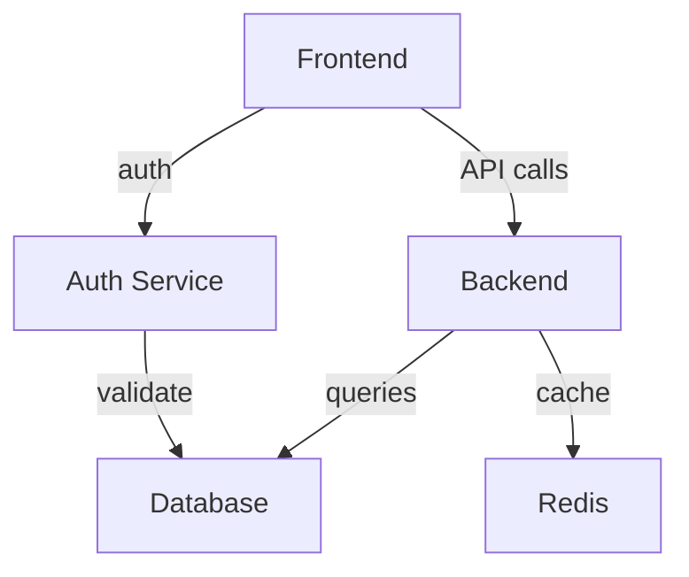

# Codebase Graph Skill

Turn code into interactive knowledge graphs for exploration and understanding.

## Core Principles

1. **Visual first** — graphs reveal patterns text hides
2. **Interactive** — click to explore, zoom to focus
3. **Multi-level** — from high-level architecture to function calls
4. **Actionable** — not just pretty pictures, but decision-support
5. **Lightweight** — generate fast, no heavy dependencies

## Graph Types

| Type | Shows | Use For |
|------|-------|---------|
| **Dependency** | Module imports/exports | Understanding coupling |
| **Call Graph** | Function call chains | Tracing execution |
| **Data Flow** | How data moves through system | Debugging pipelines |
| **Architecture** | High-level component relationships | Onboarding, design review |
| **Module** | Package/directory structure | Project navigation |

## Generation Approaches

### 1. Static Analysis (No Runtime)

```bash
# JavaScript/TypeScript: madge
npx madge --image graph.svg src/

# JavaScript/TypeScript: dependency-cruiser
npx depcruise --output-type dot src/ | dot -Tsvg > graph.svg

# Python: pydeps
pydeps --max-bacon=2 --cluster -o graph.svg

# Go: go mod graph
go mod graph | dot -Tsvg > graph.svg
```

### 2. Runtime Analysis

```bash
# Node.js: clinic.js
npx clinic doctor -- node app.js
# Generates interactive flamegraph

# Python: py-spy
py-spy top --pid <PID>
```

### 3. Git History Analysis

```bash
# File change frequency (hotspot detection)
git log --pretty=format: --name-only | sort | uniq -c | sort -rg | head -20

# Co-change analysis (files changed together)
git log --name-only --pretty=format:"" | awk 'NF{files[$0]++} END{for(f in files) print files[f], f}' | sort -rn
```

## Output Formats

### Mermaid (GitHub-compatible)



### D3.js (Interactive HTML)

```html
<!DOCTYPE html>
<html>
<head>
  <script src="https://d3js.org/d3.v7.min.js"></script>
</head>
<body>
  <svg id="graph"></svg>
  <script>
    // Interactive force-directed graph
    const nodes = [...];
    const links = [...];
    // D3 force simulation
  </script>
</body>
</html>
```

### Graphviz (Static SVG)

```bash
# Generate from dependency analysis
npx madge --dot src/ | dot -Tsvg > architecture.svg
```

## Analysis Patterns

### Module Coupling Analysis

```bash
# Find highly coupled modules
npx madge --circular src/          # Circular dependencies
npx madge --depends-on Module src/ # Who depends on Module
npx madge --orphans src/           # Unused modules
```

### Hotspot Detection

```bash
# Files changed most frequently (potential hotspots)
git log --since="6 months ago" --pretty=format: --name-only | \
  sort | uniq -c | sort -rg | head -20
```

### Architecture Compliance

```bash
# Check layer violations (e.g., UI importing from DB)
npx madge --image graph.svg src/
# Visual inspection for arrows crossing layers
```

## Interactive Exploration

### VS Code Integration

```bash
# Install dependency visualization extension
code --install-extension medozs.vscode-dependency-graph

# Open graph in VS Code
npx madge --image graph.svg src/
code graph.svg
```

### Web-Based Exploration

```html
<!-- Simple interactive graph viewer -->
<iframe src="graph.svg" width="100%" height="600px"></iframe>
```

## Use Cases

| Scenario | Graph Type | Tool |
|----------|-----------|------|
| Onboarding new dev | Architecture | madge + Mermaid |
| Debugging slow query | Call graph | clinic.js |
| Refactoring module | Dependency | depcruiser |
| Finding dead code | Orphan | madge --orphans |
| Understanding data flow | Data flow | Manual + Mermaid |

## When to Use

- Onboarding to unfamiliar codebase
- Planning refactoring (see what will break)
- Debugging complex execution paths
- Documenting architecture for team
- Finding circular dependencies
- Identifying dead code

## When NOT to Use

- Simple projects (< 10 files) — just read the code
- Quick questions — use `code-explorer` instead
- Code review — use `code-reviewer` instead

## See Also

- `skill: archify` — polished architecture diagrams
- `agent: code-explorer` — trace execution paths
- `agent: code-architect` — design new architectures
- `skill: refactoring-patterns` — what to do with the insights
