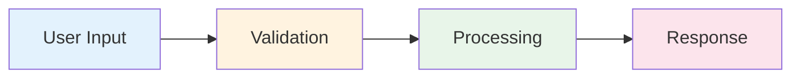

# Open Montage Skill

Create visual compositions combining code, diagrams, text, and visual elements into unified layouts.

## Core Principles

1. **Compositional** — combine multiple elements into one view
2. **Visual-first** — communicate through layout, not just text
3. **Interactive** — clickable, zoomable, explorable
4. **Exportable** — HTML, SVG, PNG, PDF outputs
5. **Templated** — start from patterns, customize as needed

## Montage Types

| Type | Elements | Use Case |
|------|----------|----------|
| **Code Montage** | Code snippets + annotations | Documentation, tutorials |
| **Architecture Montage** | Diagrams + labels + connections | System design reviews |
| **Data Montage** | Charts + tables + highlights | Dashboard previews |
| **Story Montage** | Steps + visuals + narrative | Onboarding, walkthroughs |
| **Comparison Montage** | Side-by-side before/after | Refactoring, reviews |

## Generation Approaches

### 1. HTML/CSS Composition

```html
<!DOCTYPE html>
<html>
<head>
  <style>
    .montage { display: grid; grid-template-columns: 1fr 1fr; gap: 20px; }
    .code-panel { background: #1e1e1e; color: #d4d4d4; padding: 20px; border-radius: 8px; }
    .diagram-panel { background: #f5f5f5; padding: 20px; border-radius: 8px; }
    .annotation { background: #fff3cd; padding: 10px; border-left: 4px solid #ffc107; }
  </style>
</head>
<body>
  <div class="montage">
    <div class="code-panel">
      <pre><code>// Code snippet</code></pre>
    </div>
    <div class="diagram-panel">
      <!-- SVG diagram -->
    </div>
  </div>
  <div class="annotation">Key insight or explanation</div>
</body>
</html>
```

### 2. SVG Composition

```svg
<svg viewBox="0 0 800 600">
  <!-- Background -->
  <rect width="800" height="600" fill="#f8f9fa"/>
  
  <!-- Code block -->
  <foreignObject x="20" y="20" width="380" height="280">
    <pre><code>function hello() {
  return "world";
}</code></pre>
  </foreignObject>
  
  <!-- Diagram -->
  <circle cx="600" cy="150" r="50" fill="#4CAF50"/>
  <text x="600" y="155" text-anchor="middle" fill="white">API</text>
  
  <!-- Connection -->
  <line x1="400" y1="150" x2="550" y2="150" stroke="#333" stroke-width="2"/>
  
  <!-- Annotation -->
  <rect x="20" y="320" width="760" height="60" fill="#fff3cd" rx="4"/>
  <text x="40" y="355" fill="#856404">This function handles user authentication</text>
</svg>
```

### 3. Mermaid + Code



## Layout Patterns

### Side-by-Side Comparison

```html
<div style="display: grid; grid-template-columns: 1fr 1fr; gap: 20px;">
  <div class="before">
    <h3>Before</h3>
    <pre><code>// Old code</code></pre>
  </div>
  <div class="after">
    <h3>After</h3>
    <pre><code>// New code</code></pre>
  </div>
</div>
```

### Flow Diagram with Code

```html
<div class="flow">
  <div class="step">
    <div class="step-number">1</div>
    <div class="step-content">
      <h4>Parse Input</h4>
      <pre><code>const data = JSON.parse(input);</code></pre>
    </div>
  </div>
  <div class="arrow">→</div>
  <div class="step">
    <div class="step-number">2</div>
    <div class="step-content">
      <h4>Validate</h4>
      <pre><code>if (!data.id) throw new Error();</code></pre>
    </div>
  </div>
</div>
```

### Dashboard Preview

```html
<div class="dashboard">
  <div class="metric-card">
    <h3>Users</h3>
    <div class="value">1,234</div>
    <div class="trend">+12%</div>
  </div>
  <div class="chart-panel">
    <!-- Chart SVG -->
  </div>
  <div class="table-panel">
    <!-- Data table -->
  </div>
</div>
```

## Use Cases

| Scenario | Montage Type | Elements |
|----------|-------------|----------|
| Code review | Comparison | Before/after code + annotations |
| Architecture review | Architecture | Diagrams + component labels |
| Feature demo | Story | Steps + screenshots + narrative |
| Bug explanation | Code | Code + error + fix |
| Onboarding | Story | Flow + explanations + examples |
| Dashboard design | Data | Mock charts + tables + metrics |

## Export Formats

| Format | Tool | Use Case |
|--------|------|----------|
| HTML | Direct | Interactive sharing |
| SVG | Export | Scalable graphics |
| PNG | Puppeteer/Playwright | Static images |
| PDF | Puppeteer/Playwright | Documentation |

## When to Use

- Visual documentation
- Code review presentations
- Architecture discussions
- Feature demonstrations
- Bug explanations
- Onboarding materials
- Dashboard mockups

## When NOT to Use

- Simple code snippets → use code blocks
- Pure text documentation → use markdown
- Interactive demos → use actual code
- Real-time data → use live dashboards

## See Also

- `skill: archify` — formal architecture diagrams
- `skill: documentation-lookup` — find visual examples
- `agent: doc-updater` — update documentation
